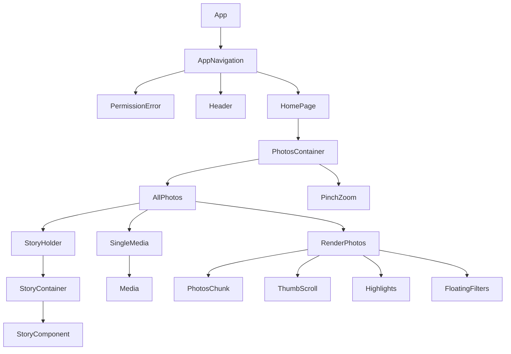

# Latest 2 Updates

June-12-2021: I am switching the animations to reanimated and switching states to recoil. So far performance issue has been resoled for parts that are moved. This is being done in branch: "reanimatd-recyclerlistview"

June-10-2021: Changing state management to recoil + removing some unnecessary states and switching to useRef to improve performance

# BOX Photos development guide
Note: Project is still in alpha phase and not production ready. We aim to release beta version by end of June 2021.

[Intro Blog](https://dev.to/fx/google-photos-open-source-alternative-with-react-native-80c)

## Project Description

BOX Photos is a react-native(expo)+typescript application to replace Google Photos/Apple Photos, and give freedom in hosting your photos on any platform, either centralized servers like Amazon or Microsoft, or decentralized solutions like "BOX". It is optimized for decentralized IPFS platforms like "BOX". Your can easily use it with a "BOX" to host your files and photos with the same experience you had using Google Photos, however, with full privacy.

## Why?
IPFS + BOX Photos = Awesome!

Google photos is a great service with great benefits however, there are major setbacks with it:

1- It is not free anymore

2- It does not respect our privacy

We developed this project with the smoothness and features of popular gallery apps in mind to enable anyone jump on and start using it right away. Furthermore, it can connect to "BOX", a decentralized node based on IPFS instead of centralized cloud networks. We are also working on enabling it to connect to centralized cloud networks, however, with web3.0 privacy, do you still want to use web2.0? more information at the [BOX website](https://fx.land)

## demo

Checkout full demo video at: https://youtu.be/wDxaC1HF5PQ

Or checkout individual features below:
- Pinch/zoom to switch between modes: 
- 
- Opening a single image in fullscreen mode: 
- 
- Header animation(hide on scroll down and show on scroll up): 
- 
- Highlights/Story: 
- 
- Fast scroll/Thumb scroll feature: 
- 

## table of content

- [Install npm, git and expo-cli](#Installing-Pre-requisites)
- [Clone the project](#clone-the-project)
- [Install requirements](#install-requirements)
- [Run](#run)
- [Packages](#packages)
- [Pages structure](#pages-structure)
- [Components structure](#components-structure)
- [Components description](#components-descripction)

### Installing Pre-requisites

- NodeJS/NPM

This application needs NodeJs to run. You can download and install NodeJs from the below link on any platform if you do not have it already.
[Download NodeJS](https://nodejs.org/en/)

you can also check if you already have NodeJs installed by running the following two commands in terminal window

```
node -v
npm -v
```

- Git:
You can use git to easily download the files from github into your computer (or if you prefer you can download files manually from this github repository in step 1 of cloning the application)
[Download Git-Scm](https://git-scm.com/downloads)

you can also check whether you already have NodeJs installed by running the following command in terminal window

```
git --version
```

Now you need to install expo-cli. If you want to know more about expo check their website. [Expo](https://docs.expo.io/)
```
npm install --global expo-cli
```

Optional: if you prefer yarn you can install yarn.
```
npm install --global yarn
```

## Clone the project

You can clone the project by running the command below to your terminal:

for https cloning:
```bash
git clone https://github.com/functionland/photos.git
```
```bash
cd photos
```


## Install requirements

you can install the requirements with command:
```bash
yarn install
```
or (do not use both)
```bash
npm install
```

## Run

You can run the application in expo-cli using the below command. It gives you a QR code which you can use on your phone(in expo GO application) to open and test the application on your phone(both iOS and Android). Or you can build the android or iOS installation files.

```bash
expo start
```

## Packages

- We used **expo Media Library** for getting the data from user's phone.
- We used a modified version of **expo-video-player** to play videos. It is available in our repo.
- We used a modified version of **react-native-stories-view** for the story style view on top of gallery, which is available in our repo.
- We used **RecyclerListView** from FlipKart, as the scrollView for the photos.

## Pages structure

For now we have two pages in the app:
- The HomePage that is the main page for showing the media files.
- The PermissionError page that is the page we show when there is permission error from user's phone.
- We are working on creating the "Library" and "Search" pages.

## Components structure

```├── app.json
├── App.tsx
├── babel.config.js
├── components
│   ├── AllPhotos.tsx
│   ├── FloatingFilters.tsx
│   ├── Header.tsx
│   ├── Highlights.tsx
│   ├── Media.tsx
│   ├── PhotosChunk.tsx
│   ├── PhotosContainer.tsx
│   ├── PinchZoom.tsx
│   ├── RenderPhotos.tsx
│   ├── SingleMedia.tsx
│   ├── StoryHolder.tsx
│   └── ThumbScroll.tsx
├── index.js

├── metro.config.js
├── navigation
│   └── AppNavigation.tsx
├── package.json
├── package-lock.json
├── pages
│   ├── HomePage.tsx
│   └── PermissionError.tsx
├── store
│   ├── actions.ts
│   ├── reducer.ts
│   └── store.ts
├── __tests__
│   └── App-test.tsx
├── tsconfig.json
├── types
│   └── interfaces.ts
└── utils
    ├── APICalls.ts
    ├── constants.ts
    ├── functions.ts
    ├── LayoutUtil.ts
    └── permissions.ts

```

## Components description

The components are as what follows:
### PhotosContainer
**Purpose:** this component is responsible for getting the photos and videos from storage and feed the AllPhotos component with storage photos.
- this component include the PinchZoom component and AllPhotos component
### PinchZoom
**Purpose:** This component is responsible for all the animations for switching between different column modes, and actions we want to do when animations done.
- This component is wrapped around the AllPhotos component.
- The component uses GestureHandlers to respond to pinch and pan gestures

### AllPhotos
**Purpose:** This component is wrapped the three RenderPhotos components and is responsible for lazy load the photos and feed the render photos with proper data.
-  The three different kind of RenderPhotos is the month view with 4 columns of photos, the day view with 3 columns of photos and the day view with 2 columns of photos.

### RenderPhotos
**Purpose:** This component includes with the number of PhotosChunk components and one FlatList that wrapped all the PhotosChunk components that we want to show the user. It is responsible to show the Photos(main) page of hte application.
- This component also renders date headers.
- It uses RecyclerListView to show the scrollable grid of photos

### PhotosChunk:
**Purpose:** This component is responsible to show each block/Thumbnails in the gallery.

### FloatingFilters:
**Purpose:** This component is responsible to show and position the "year" titles when fingers are placed on thumb scroll.

### Header:
**Purpose:** This component is responsible to show the top header of the application. It is used in the top Navigationbar.

### Highlights:
**Purpose:** This component is responsible to show the story thumbnails and text on top of Photos page.

### Media:
**Purpose:** This component is responsible to display photo or video when opened in full page. It is the component used in SingleMedia.

### SingleMedia:
**Purpose:** This component is responsible to show modal with the content when image or video is opened in full page. It uses Media to show the photo or video.

### StoryHolder:
**Purpose:** This component is responsible to show each story/highlight in full screen when thumbnail is clicked on.

### ThumbScroll:
**Purpose:** This component is responsible to show the thumb scroll icon in the right of screen when scrolling.

## Components diagram



## Road map
 
 * [x] Pinch/zoom to switch between 3 modes
 * [x] Open each image/video in a Single image modal and scroll between images
 * [x] Show highlights
 * [x] Fast scroll/thumb scroll
 * [x] Select and unselect each image to delete/edit/share
 * [ ] Connect with BOX, AWS and other cloud services to upload/download media
 * [ ] Search page to search by date/tags
 * [ ] Library page to show images by folder/Album
 * [ ] AI features to do on-device analysis for face recognition/object recognition
