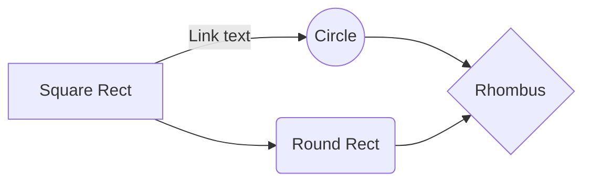

# The Box development guide

## Project Description
The Box is a react-native application for show the media files in user phone and sync the files with physical device.

## table of content

- [Clone the project](#clone-the-project)
- [Install requirements](#install-requirements)
- [Packages](#packages)
- [Pages structure](#pages-structure)
- [Components structure](#components-structure)
- [Components descripction](#components-descripction)

## Clone the project

You can clone the project by running the command below to your terminal:

for https cloning:
```bash
git clone https://github.com/functionland/photos.git
```

for ssh cloning:
```bash
git clone git@github.com:functionland/photos.git
```
[project github link](https://github.com/woforo/TheBox)

## Install requirements

you can install the requirements with command:
```bash
npm install
```

## Packages

we use **expo Media Libary** for getting the data from user's phone.

## Pages structure

For now we have two pages in the app:
- The HomePage that is the main page for showing the media files.
- The PermissionError page that is the page we show when there is permission error from user's phone

## Components structure

```├── app.json
├── App.tsx
├── babel.config.js
├── components
│   ├── AllPhotos.tsx
│   ├── PhotosChunk.tsx
│   ├── PhotosContainer.tsx
│   ├── PinchZoom.tsx
│   ├── RenderPhotos.tsx
│   └── SinglePhoto.tsx
├── index.js

├── metro.config.js
├── navigation
│   └── AppNavigation.tsx
├── package.json
├── package-lock.json
├── pages
│   ├── HomePage.tsx
│   └── PermissionError.tsx
├── store
│   ├── actions.ts
│   ├── reducer.ts
│   └── store.ts
├── __tests__
│   └── App-test.tsx
├── tsconfig.json
├── types
│   └── interfaces.ts
└── utils
    ├── APICAlls.ts
    ├── constants.ts
    ├── functions.ts
    └── permissions.ts

```


## Components descripction

The components are as follows:
### PhotosContainer
- this component is responsible for getting the photos and videos from storage and feed the AllPhotos component with storage photos.
- this component include the PinchZoom component and AllPhotos component
### PinchZoom
- This component is responsible for all the animations and actions we want to do when animations done.
- This component is wraped around the AllPhotos component.
- The prop types of this component is :
    - distance: Animated.Value
    - setPinchOrZoom: Function
    - setSortCondition: Function
    - setNumColumns: Function
    - numColumns: 2 | 3 | 4
    - sortCondition: sortCondition

### AllPhotos
- This component is wraped the three RenderPhotos components and is responsible for lazy load the photos and feed the render photos with proper data.
-  The three different kind of RenderPhotos is the month view with 4 columns of photos, the day view with 3 columns of photos and the day view with 2 columns of photos.
-  The prop types of the component is:
    - photos: array of PhotoIdentifier
    - distance: Animated.Value
    - pinchOrZoom: 'pinch' | 'zoom' | undefined
    - sortCondition: sortCondition
    - numColumns: 2 | 3 | 4

### RenderPhotos
- This component includes with the number of PhotosChunk components and one FlatList that wraped all the PhotosChunk components that we want to show the user.
- The height of this component is the height of the user's phone screen.
- The prop types is:
    - photos: array of photoChunk
    - margin: Animated.AnimatedInterpolation
    - maxWidth: number
    - minWidth: number
    - numColumns: 2 | 3 | 4
    - opacity: Animated.AnimatedInterpolation
    - date: Date
    - loading: boolean
    - separator: 'day' | 'month'
    - getMorePhotosFunction: Function
    - setWrapperHeight: Function
    - wrapperHeight: number | undefined

### PhotosChunk:
- This component has one title called date and number of photos which captured on that date.
- It should render all photos in flex display with the date title on top of photos and the photos and the title should disappear or appear with the pinch or zoom animation.
- It has prop types like this:
    - date: string
    - photos: array of PhotoIdentifier
    - opacity: Animated.AnimatedInterpolation
    - numCol: 2 | 3 | 4
    - setWrapperHeight: Function

## Components diagram


